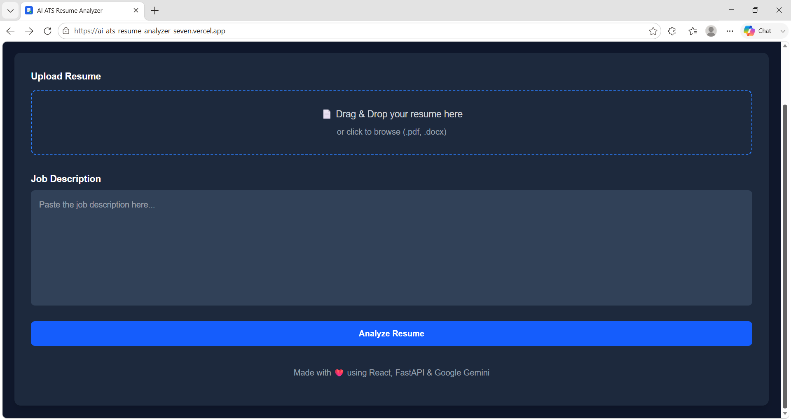
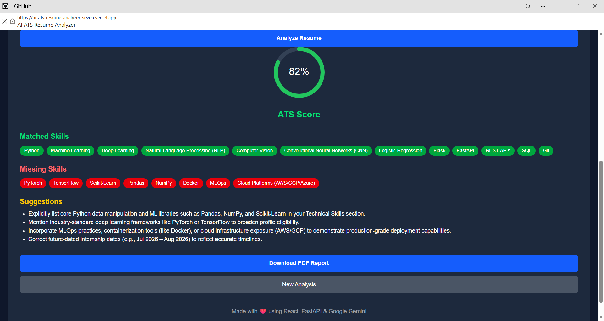
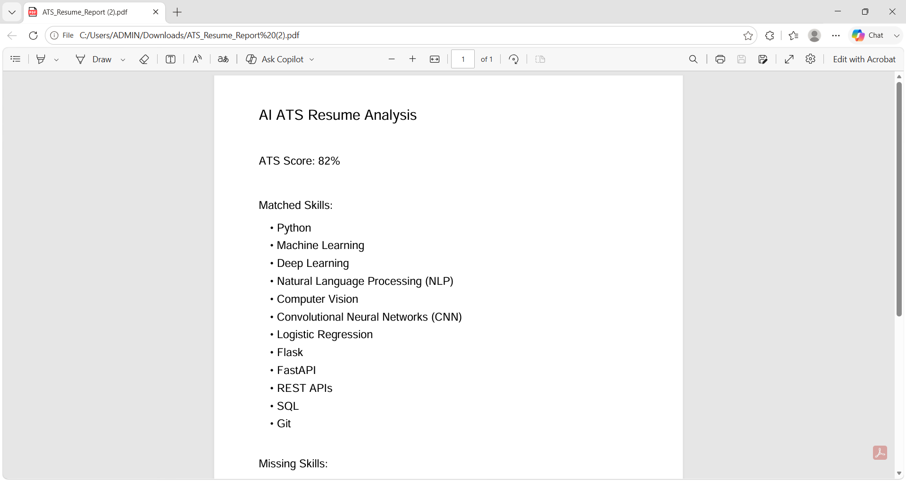

# 🤖 AI ATS Resume Analyzer

An AI-powered **Applicant Tracking System (ATS) Resume Analyzer** that helps job seekers improve their resumes by comparing them with job descriptions. The application uses **Google Gemini AI** to analyze resume content, generate ATS compatibility scores, identify matching and missing skills, and provide actionable improvement suggestions.

Built with **React, FastAPI, Python, and Generative AI**.

---

## 🚀 Live Demo

🌐 **Frontend Application:**  
https://ai-ats-resume-analyzer-seven.vercel.app/

⚙️ **Backend API:**  
https://ai-ats-resume-analyzer-1296.onrender.com/

---

# ✨ Features

## 📄 Resume Upload & Processing
- Upload resumes in PDF and DOCX formats
- Automatically extract resume content
- Compare resume with target job descriptions

## 🤖 AI-Powered Resume Analysis
- Generate ATS compatibility score
- Identify matching skills
- Detect missing keywords and skills
- Provide AI-generated improvement suggestions

## 📊 Interactive Result Dashboard
- Visual ATS score representation
- Matched skills display
- Missing skills identification
- Resume improvement recommendations

## 📥 PDF Report Generation
- Download complete ATS analysis report
- Includes ATS score, skills analysis, and suggestions

## ⚡ User Experience
- Modern responsive UI
- Fast API-based architecture
- AI-powered analysis workflow
- Reset option for new resume analysis

---

# 🖥️ Application Screenshots

## Home Page



## ATS Analysis Result



## PDF Report



---

# 🏗️ System Architecture

```
                         User
                           |
                           |
                           v
                 React Frontend (Vercel)
                           |
                           |
                    REST API Request
                           |
                           v
                 FastAPI Backend (Render)
                           |
                           |
                 Resume Text Extraction
                           |
                           |
                           v
                    Google Gemini AI
                           |
                           |
                           v
                 ATS Analysis Result
```

---

# 🛠️ Tech Stack

## Frontend
- React.js
- Vite
- Tailwind CSS
- Axios
- React Circular Progressbar
- jsPDF

## Backend
- Python
- FastAPI
- REST API
- Uvicorn

## AI & NLP
- Google Gemini AI
- Resume text extraction
- Keyword matching
- AI-generated recommendations

## Deployment
- Vercel (Frontend)
- Render (Backend)

---

# 📂 Project Structure

```
AI-ATS-Resume-Analyzer/

│
├── frontend/
│   │
│   ├── src/
│   │   ├── components/
│   │   ├── pages/
│   │   ├── services/
│   │   └── App.jsx
│   │
│   ├── public/
│   ├── package.json
│   └── index.html
│
├── backend/
│   │
│   ├── app/
│   │   ├── routes/
│   │   ├── services/
│   │   └── main.py
│   │
│   ├── requirements.txt
│   └── .env
│
└── README.md
```

---

# ⚙️ Installation & Setup

## Clone Repository

```bash
git clone https://github.com/Shraaavani/AI-ATS-Resume-Analyzer.git

cd AI-ATS-Resume-Analyzer
```

---

# 🔧 Backend Setup

Navigate to backend folder:

```bash
cd backend
```

Create virtual environment:

```bash
python -m venv venv
```

Activate environment:

### Windows

```bash
venv\Scripts\activate
```

Install dependencies:

```bash
pip install -r requirements.txt
```

Create `.env` file:

```
GEMINI_API_KEY=your_google_gemini_api_key
```

Run backend server:

```bash
uvicorn main:app --reload
```

Backend runs at:

```
http://127.0.0.1:8000
```

---

# 🎨 Frontend Setup

Open another terminal:

```bash
cd frontend
```

Install dependencies:

```bash
npm install
```

Start development server:

```bash
npm run dev
```

Frontend runs at:

```
http://localhost:5173
```

---

# 🔄 Application Workflow

1. User uploads a resume (PDF/DOCX)
2. Resume text is extracted
3. User enters a job description
4. React frontend sends data to FastAPI backend
5. Backend processes resume content
6. Google Gemini AI analyzes resume-job compatibility
7. ATS score and recommendations are generated
8. User views results and downloads PDF report

---

# 🔐 Environment Variables

The backend requires:

```
GEMINI_API_KEY
```

The API key is securely stored in backend environment variables and is never exposed to the frontend.

---

# 🔮 Future Enhancements

- User authentication
- Resume analysis history
- Database integration
- Multiple resume comparison
- AI-powered resume rewriting
- Job recommendation system
- Advanced ATS score breakdown
- Resume improvement tracking

---

# 👩‍💻 Author

## Shravani Kamble

**AI/ML Engineer | Python Developer | Full Stack Developer**

GitHub:  
https://github.com/Shraaavani

---

LinkedIn: 
https://www.linkedin.com/in/shravani-kamble-9b9345346/

---

# ⭐ Support

If you find this project useful, consider giving it a ⭐ on GitHub.